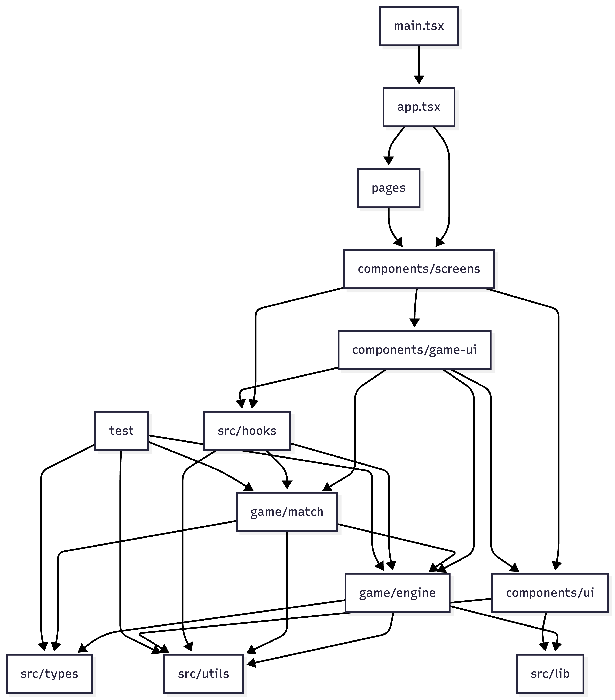

# project file documentation

this file provides in-depth, lowercase documentation for each file and folder in the src directory, including purpose, main functions, and dependencies.

---

## src/components/game-ui/
- **countdownoverlay.tsx**: displays a countdown overlay before the game starts. used by typingarena and matchhud. relies on framer-motion for animation and cn utility for classnames. props: count, isvisible, classname.
- **healthbar.tsx**: shows player health during the match. used in matchhud. uses framer-motion for animation and cn utility. props: current, max, showdamage, isplayer, classname.
- **matchfoundoverlay.tsx**: overlay shown when a match is found. used in playscreen. depends on rankbadge, player type, cn utility. props: isvisible, player, opponent, onready.
- **matchhud.tsx**: main heads-up display for match info, health, and status. uses healthbar, rankbadge. depends on framer-motion, player type, cn utility. props: player, opponent, currentround.
- **queueoverlay.tsx**: overlay for queueing players before match starts. used in playscreen. uses framer-motion, cn utility. props: isvisible, oncancel, elapsedtime, classname.
- **rankbadge.tsx**: displays player rank badge. used in matchhud. uses framer-motion, cn utility, getrankfromrating, rank. props: rating, size, showrating, classname.
- **resultcards.tsx**: shows results after a match. used in resultsscreen. uses framer-motion, cn utility, roundstats. props: label, value, suffix, highlight, delay.
- **roundendoverlay.tsx**: overlay shown at the end of a round. used in typingarena. uses framer-motion, roundresultcard, roundresult, cn utility. props: isvisible, roundresult, oncontinue, drawavailable.
- **typingarena.tsx**: main game area for typing matches. uses typingdisplay, roundendoverlay, countdownoverlay. depends on typingdisplay, usetypingengine, roundstats, cn utility. props: text, isactive.
- **typingdisplay.tsx**: displays the text to be typed. used in typingarena. uses framer-motion, cn utility. props: text, typed, currentindex, classname.

---

## src/game/engine/
- **index.ts**: entry point for game engine logic. re-exports main engine modules: types, seed, text, metrics, reducer.
- **metrics.ts**: calculates game metrics such as correct characters, total typed, errors, accuracy, raw wpm, wpm, consistency, and elapsed time. provides functions for counting correct characters and building metrics from typing state. used by reducer and scoring modules.
- **reducer.ts**: handles game state transitions and manages typing state. provides functions to create typing state, update state based on actions, and sample typing progress. uses metrics, text generation, and types. used in typingarena and engine.
- **seed.ts**: generates deterministic random seeds for game sessions. implements hashing and xorshift32 for pseudo-random number generation. used in text generation and engine for reproducible matches.
- **text.ts**: handles text generation and manipulation for typing matches. uses make_rng from seed.ts and difficulty/type definitions. provides curated word lists and generates random text based on seed, length, and difficulty. used in typingdisplay and engine.
- **types.ts**: type definitions for engine logic, including typingmode, typingstatus, difficulty, typingoptions, typingstate, and typingaction. ensures type safety across engine modules.
- **__tests__/engine.test.ts**: unit tests for engine logic, validating metrics, reducer, and text generation.

---

## src/game/match/
- **index.ts**: entry point for match logic. re-exports match functions and types.
- **scoring.ts**: implements scoring algorithms for matches, including rating calculations, round stats, and rank determination. used in resultsscreen and engine.
- **types.ts**: type definitions for match logic, including player, match, round, and scoring structures.

---

## src/components/screens/
- **homescreen.tsx**: main landing screen. uses ui components for navigation and display.
- **playscreen.tsx**: game play screen. integrates game-ui and engine components to run matches.
- **resultsscreen.tsx**: displays match results. uses resultcards and scoring utilities to show performance.

---

## src/components/ui/
- **various .tsx files**: generic ui components (buttons, dialogs, forms, etc.) used throughout the app for consistent design and interaction.

---

## src/hooks/
- **use-mobile.tsx**: detects mobile device usage and adapts ui accordingly.
- **use-toast.tsx**: provides toast notification functionality for user feedback.
- **usegamestate.tsx**: manages game state using reducer and engine logic, tracks progress and status.
- **usetypingengine.tsx**: manages typing engine logic for matches, handles input and state updates.

---

## src/lib/
- **utils.ts**: general utility functions used across the app for common operations.

---

## src/pages/
- **index.tsx**: main page component, entry point for routing.
- **notfound.tsx**: 404 page component, shown for invalid routes.

---

## src/test/
- **example.test.ts**: example test file for demonstrating test structure.
- **setup.ts**: test setup and configuration for initializing test environment.

---

## src/types/
- **game.ts**: type definitions for game logic and state, including player, match, and round types.

---

## src/utils/
- **scoring.ts**: utility functions for scoring, including rating calculations and rank determination.
- **textseed.ts**: utility functions for text seed generation, used in reproducible matches.

---

---

## file interaction pipeline

the following diagram shows how major files and folders interact in the project, illustrating the flow of data and dependencies:

**mermaid source:** see project_pipeline.mmd for the editable mermaid diagram source.

**how to update the diagram:**
1. edit project_pipeline.mmd as needed.
2. use a mermaid editor (online or VS Code extension) to export the diagram as a png or svg.
3. replace project_pipeline.png with the new image.
4. the markdown will always show the latest image, and the mermaid file is available for future edits.

**explanation:**
main.tsx initializes the app and renders app.tsx. app.tsx manages routing and connects to screens. screens use game-ui for game-specific components, ui for generic components, and hooks for state and logic. game-ui interacts with engine and match for backend logic, and also uses ui and hooks. engine and match rely on utils, types, and lib for shared logic and definitions. hooks connect to engine, match, and utils for state management. ui and lib provide reusable components and functions. pages handle routing and connect to screens. test files validate engine, match, utils, and types.

for each file, see the top comment for a concise summary. this markdown provides deeper context, dependencies, usage patterns, and the pipeline of file interactions.
